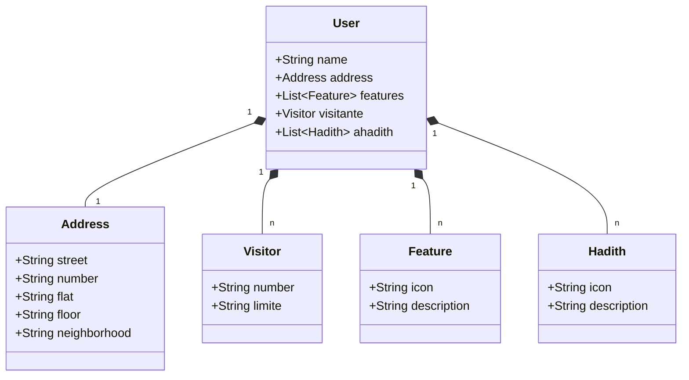

### 📝 Explicação do Programa
O programa é uma aplicação Java baseada no framework **Spring Boot**, configurada para ser uma aplicação web que utiliza **Swagger** para facilitar a documentação de APIs REST.

### 🚀 O que o programa faz

| 🏁 Função                      | 📌 Descrição |
|-------------------------------|-------------|
| 🔹 **Inicialização da Aplicação** | O método `main` inicia o servidor embutido (**Tomcat**) e configura o contexto da aplicação. |
| 🔹 **Configuração de Servidor e Documentação** | A anotação `@OpenAPIDefinition` configura o **Swagger** para documentar a API. O servidor padrão é definido na URL `/`. |
| 🔹 **Leitura de Variáveis de Ambiente** | O programa imprime informações sobre o banco de dados (**URL, host, porta, nome e usuário**) obtidas de variáveis de ambiente (`System.getenv`). |

### 🛠️ Tecnologias Usadas

| ⚙️ Tecnologia     | 🎯 Finalidade |
|------------------|-------------|
| ☕ **Java** | Linguagem principal para desenvolver a aplicação. |
| 🌱 **Spring Boot** | Framework que simplifica o desenvolvimento e fornece um servidor embutido (**Tomcat**). |
| 📜 **Swagger (OpenAPI)** | Ferramenta para documentar e testar APIs REST. Configurada com `@OpenAPIDefinition`. |
| 🗄️ **Banco de Dados** | Configurado para se conectar a um banco de dados **PostgreSQL** via variáveis de ambiente configuradas no **Railway**. |
| 🏗️ **Tomcat** | Servidor embutido usado para hospedar a aplicação web. |

### 🌍 Impacto e Aplicações

| 💡 Utilidade                    | 🔎 Benefícios |
|---------------------------------|-------------|
| 📡 **APIs RESTful** | Base para criar APIs consumidas por **apps móveis, sistemas web** e outras aplicações. |
| 📖 **Documentação Automática** | Com **Swagger**, os desenvolvedores podem visualizar e testar endpoints de forma interativa, aumentando a produtividade. |
| 🏬 **Integração com Bancos de Dados** | Usado para **gerenciar dados** em sistemas de cadastro, controle de estoque, etc. |
| ❤️ **Impacto Social** | Pode ser usada em soluções para **ONGs, plataformas educacionais** ou ferramentas de acessibilidade. |

### Fluxograma do projecto 🚀

